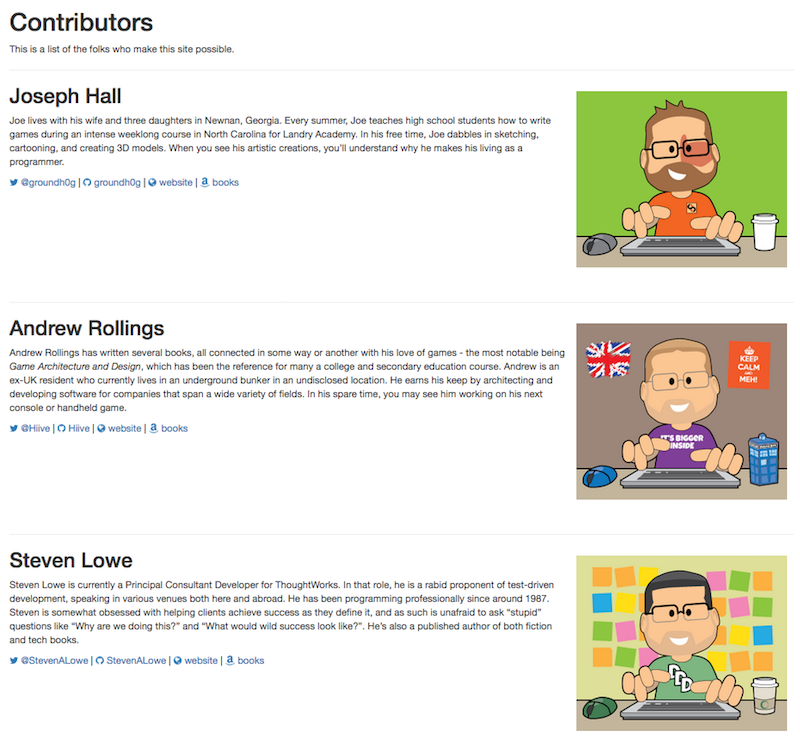

# Jekyll Faces

Jekyll is a great blogging platform, but to make it really shine, you need to make some tweaks. We've made those tweaks, and we've done so in such a way as to avoid using plugins, so your site can easily be hosted on [GitHub Pages]({{ site.baseurl }}/docs/10-hosting-on-github-pages.html).

Check us out at [JekyllFaces.com](http://jekyllfaces.com/)!

> **NOTE:** This project isn't quite ready for primetime. It's getting there, though. ETA is first part of July, 2017.

## Project Landing Page

## Contributors Page

## Book Progress Page

## 12 Built-In 404 Pages

