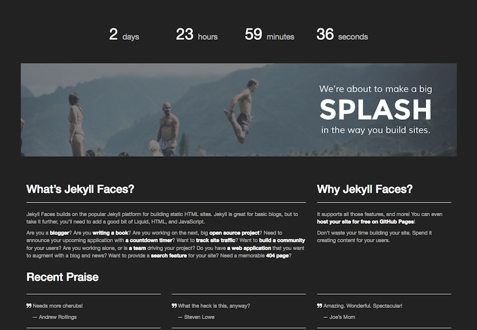

The coming soon page is a simple, one-page layout to tease your next project. Content for this page is stored in `soon/index.md`, and stylings are stored in `assets/soon.css`. The example page includes a countdown timer and an image header with parallax scrolling effect.

To set the coming soon page as the homepage, edit the `_config.yml` file.

```
  # one of [blog | project | soon | webapps]
  homepage: soon
```

The resulting page look similar to the following image.

> 