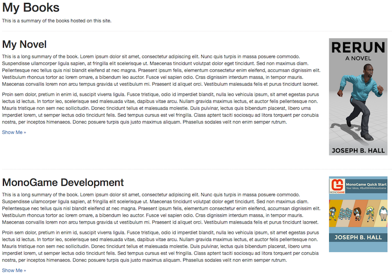

If you want to write a book and let the world watch as the text evolves, Jekyll Faces has you covered. Hosting your book in git means that your readers can submit corrections as pull requests, or file bug reports.

To enable the books page, and to have a link to it show in the top-level navigation bar, ensure the following values are in your `_config.yml` file.

```
jekyllfaces:

  features:
    - book     # one or more online books
    ...
```

Markdown is a great format for drafting books, and it's supported by online publishers like [Leanpub](https://leanpub.com/). The easiest way to get started is to modify one of the existing examples under the `books/` folder. The `index.md` file in that folder builds a list of books, displaying a summary from the book's `summary.md` file along with a picture (the `cover.png` file).

The resulting content should look similar to the following image.

> 

There's also an `index.md` file for each of the books. That file serves as the landing page for your book, and typically includes the current status of the chapters (which is automatically generated, along with word counts).

The resulting content should look similar to the following image.

> 
