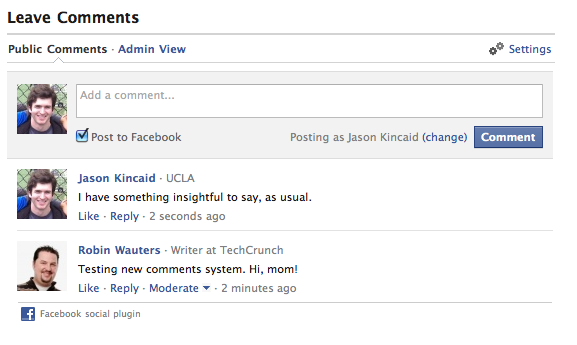

While your generated site may technically be static, that doesn't mean that it can't feel dynamic. You can let your visitors interact with you (and each other) by enabling one of the popular commenting systems. And, perhaps best of all, they won't need yet another username and password &mdash; you can enable comments from a number of popular 3rd-party sites, such as Facebook.

To add comments to your site, modify the `_config.yml` to use your provider and details.

```
  comments:
    provider: facebook # disqus | facebook | intensedebate | false
    disqus:
      short_name: example
    facebook :
      num_posts: 5
      width: 580
      colorscheme: light # light | dark
    intensedebate :
      account : example
```

> 