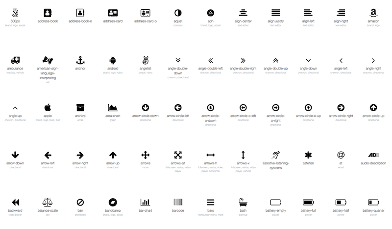

Jekyll Faces makes it easy to use web-based font icons. Several fonts are supported, each loaded from CDN (so you don't have a local copy, and you're always up-to-date).

```
jekyllfaces:

  font_icons: # uncomment the icons sets you would like to use
    - font-awesome # <i class="fa fa-address-book"></i>
    #- foundation # <i class="fi-address-book"></i>
    #- glyphicons # <i class="glyphicon glyphicon-adjust"></i>
    #- icomoon # <i class="icomoon icon-accessibility"></i>
    #- ionicons # <i class="ionicons ion-alert"></i>
    #- material-design # <i class="material-icons">3d_rotation</i>
    #- octicons # <i class="mega-octicon octicon-alert"></i>
    ...
```

> **NOTE:** Since the layouts in Jekyll Faces are currently implemented using [Bootstrap v3.3.7](http://getbootstrap.com/), the Glyphicons web font is automatically included. The examples pages that come with Jekyll Faces also rely on the Font Awesome web font, so you'll need to remove references to that font if you want to disable the `font-awesome` glyph set.

While it is possible to include all of the supported web fonts at the same time, that could affect the time it takes your pages to load. Try to limit yourself to one or two fonts, keeping in mind that the Bootstrap framework includes the Glyphicons set.

A really handy tool for browsing the available fonts is [GlyphSearch.com](http://glyphsearch.com/).

> 