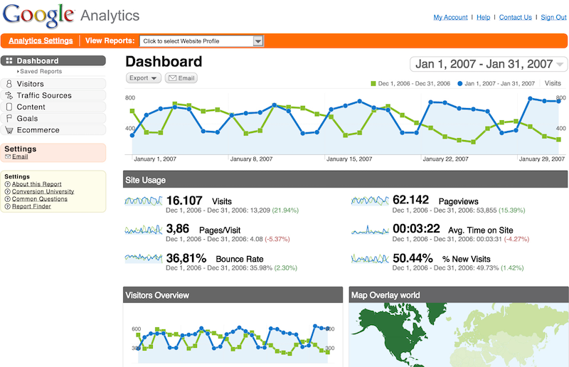

Do you want to know what search keywords are driving people to your site? Do you want to know how many visitors you've had to your site, how long they stayed, and what pages they viewed? Do you want to know where your readers are going when they leave your site? You can track this, and more, using one of the popular analytics services.

To add analytics to your site, modify the `_config.yml` to use your provider and ID.

```
  analytics:
    provider: google # gauges | google | false
    gauges:
      site_id: 'SITE ID'
    google:
      tracking_id: 'UA-123-12'
```

> 